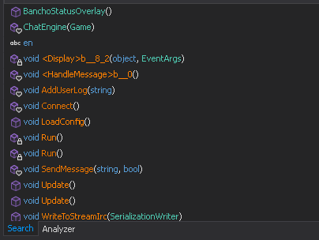

# osu! modding guide

Welcome to the ultimate guide for modding osu! clients, made for people who don't want to make use of leaked source code. I have gathered a good amount of experience with osu modding, and decided to write down on what I have learned.

## Getting Started

The first step is to choose and download the client you want to modify. If you are just getting started, I would highly recommend using one of these versions:

- [b20130606.1](https://osekai.net/snapshots/?version=179)
- [b20130303](https://osekai.net/snapshots/?version=194)
- [b1700](https://osekai.net/snapshots/?version=184)

What makes these versions special is that they are "unobfuscated", which means that the source code will be in a human-readable format when you decompile it. But don't worry - I will also provide a guide for obfuscated builds further down in this guide.

Next up you want to download [dnSpy](https://github.com/dnSpy/dnSpy/releases/download/v6.1.8/dnSpy-net-win32.zip). dnSpy is a .NET debugger and assembly editor, which will be the most important piece of software in this guide. Once you learn how to use it, you can basically do anything with your client.

Once you have downloaded it, open it up and drag the `osu!.exe` file into the Assembly Explorer.

https://github.com/user-attachments/assets/5737ebb1-a4da-4d0d-a88a-211e0dc3e639

## Using dnSpy

dnSpy provides multiple useful tools for analyzing and editing .NET binaries. The main goal of it is to convert the .NET executable/dll back to its original C# code. Not only does it give you that, but it also allows you to directly edit and debug the executable, which most other decompilers can't do.

The following sections provide a quick overview of how to use this software.

### Editing C# code

You can directly edit a C# function, by right-clicking on a section and selecting "Edit Method (C#)...".


However, this method could sometimes lead to inaccurate recompilation or, even worse, result in errors.


The only option you have now is either try to fix the errors, or edit the raw assembly.

### Editing the assembly

As you may know, when you compile C# down to it's executable, the compiler generates its own "assembly-like" format called "Intermediate Language" (IL). This is similar to Java's Byte Code, which also explains why C# is so easy to decompile.

You can edit the raw IL-Assembly, by right-clicking on a section of code and selecting "Edit IL Instructions...".


This solution works great for editing simple stuff, such as strings or integers. However, it can get complicated really fast when you want to change the whole structure of a function.

### Using the search tool

Sometimes you may want to search for something specific, like a string or function name. Worry not! I've got the perfect tool you are looking for.

Select "Edit" -> "Search Assemblies" and a new window at the bottom will show up.


Now... lets say you want to search for a string. Change the search target from "All of the Above" to "Number/String":


After that you can put in your search query and hit enter.




Now you can see all classes and functions that contain the string you searched for.
This can be really useful if you want to, for example, edit all "ppy.sh" domains to something else, i.e. for private servers.

### Function References

Another thing you might be familiar with from software such as Ghidra or IDA are function references, i.e. which function uses other functions.
Ok, this might sound a bit complicated at first, so let me give you an example.

I want to know what functions use the `SubmitScore` function, so I right-click on the function and click "Analyze".


Now you can see what the `SubmitScore` function gets "Used By", and what functions the `SubmitScore` uses itself.

### Debugging

The debugging feature is one of the most useful tool that dnSpy offers in my opinion. If you know the concept it, this may be nothing new to you.

To use it, set a breakpoint anywhere in your code and then simply click on "Start". dnSpy will automatically open the debugger tools, once it reaches that breakpoint.


After it has reached the breakpoint, dnSpy will give you access to the programs memory, as well as the usual debugging controls.

### Resource Files

osu! stores most of it's assets inside resource files. You will find them in `osu.dll`, `osu!ui.dll`, `osu!gameplay.dll` and `osu!seasonal.dll`.
dnSpy allows you to extract and edit the contents of these resource files.

Here is an example for `osu!ui.dll`


You now have the option to right-click on a resource and "Save", or even edit the resource entirely by clicking "Edit Resource..."

### XNB
In builds before ~b20130606, osu! assets will be stored as XNB files, which is a file format made for the XNA framework (what osu! uses).
This means that you'll need to convert them from XNB to PNG files, which I have a tool for [here](https://github.com/lekuruu/xnb).


## Obfuscated Builds

Almost all osu! builds you will find on [osekai](https://osekai.net/snapshots/) are obfuscated, meaning that the decompiled code has unreadable function names, class names and more.

There are many different obfuscators out there. The main ones that osu! has used or is still using are [SmartAssembly](https://www.red-gate.com/products/smartassembly/) and [Eazfuscator](https://www.gapotchenko.com/eazfuscator.net).

Here is what an obfuscated SmartAssembly executable may look like:


If you attempt to edit any of the methods, the decompiler will probably give you some errors, since one of the main goals of an obfuscator is to "confuse" the decompiler.

To make them "editable" again, you can use a deobfuscator, such as [de4dot](https://github.com/de4dot/de4dot).

```
de4dot "osu!.exe"
```

The program will output a `osu!-cleaned.exe` file, which you can edit again, but keep in mind that the function & class names are still not readable.
This tool will work pretty well for anything that isn't obfuscated with eazfuscator.

### Eazfuscator Obfuscation

All clients past 2015-2016 are obfuscated using [Eazfuscator](https://www.gapotchenko.com/eazfuscator.net). I haven't been able to find a good way to deobfuscate these clients correctly, without running into crashes. I would recommend looking at the repositories from [holly](https://github.com/holly-hacker/), since they provide some very useful resources for it.
